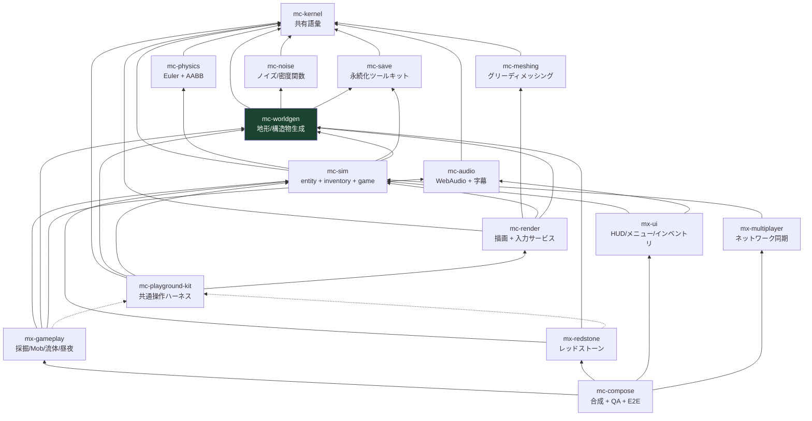
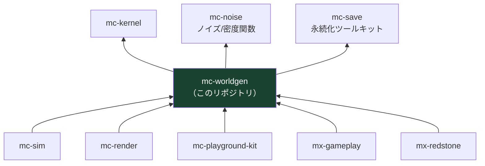

# アーキテクチャ

## 1. 4 階層

plan.md §2.2 の 4 階層。**性質が違うものを同じ階層に置かない**ことが唯一の規律である。

| 階層 | リポジトリ | 性質 |
| --- | --- | --- |
| 安定ライブラリ | kernel / noise / meshing / physics / **save** / audio | 純粋関数・狭い界面・変更頻度が低い。相互独立で並行構築できる |
| 基盤 | **worldgen** / sim / render / playground-kit | 状態とサービス（**名詞**）。体験モジュールが乗る土台 |
| 体験モジュール | mx-gameplay / mx-redstone / mx-ui / mx-multiplayer | ルールと UI（**動詞**）。互いを知らず、基盤サービス経由でのみ会話する |
| 合成 | mc-compose | Layer マージ + stage 順序表 + E2E。ロジックを持たない |

階層外に `mc-dev-meta`（plan.md §6 Step 0 の開発用 workspace）がある。
これは他リポジトリを clone するだけで、依存はしない。

## 2. 依存グラフ（16 リポジトリ全体）

実線 = 実行時依存 (`dependencies`)、点線 = プレビュー起動時のみ (`devDependencies`)。



このグラフはこのリポジトリの `oxlint.json` の `no-restricted-imports`
（DEPENDENCY_POLICY.md §5）が実効機構を担う。旧 `scripts/check-dependency-whitelist.ts`
（16 リポジトリに逐語的コピーされていた `REPOSITORY_POLICY.dependencyGraph` 定数）は
org 標準の移行に伴い廃止された。図とコードが食い違ったらコードが正である
（図のほうを直すこと）。

### 強制されるルール

| ルール | 内容 |
| --- | --- |
| ハード失敗 | 違反があれば CI は非ゼロ終了する。警告で済ませない（**現状の既知の限界**: `oxlint.json` の `no-restricted-imports` は 2026-08-01 時点でこのリポジトリが使う oxlint 1.76.0 では実際には発火しないことを確認済み。宣言的な意図表明として残しつつ、実効性は別途フォローアップが必要） |
| 循環禁止 | 例外リスト（「co-evolution ペア」等）を設けない |
| **推移閉包の禁止** | A→B、B→C のとき A は C を import できない。依存は直接依存のみが import 許可を意味する |
| kernel は例外 | mc-kernel はどこからでも import 可（ただし `package.json` への記載は必要） |
| 宣言と実体の一致 | import する `@nerima-games/*` は `package.json` に無ければ違反 |
| kit は devDependency 専用 | `dependencies` に入れたら CI fail |
| `Date.now()` 禁止 | 時刻は注入された Clock Port から取得する（現状、これを強制するスクリプトは無い。DEPENDENCY_POLICY.md/PACKAGE_STANDARD.md により org 標準としては要求されない） |

## 3. mc-worldgen の位置

**基盤階層（tier 2）の最初のリポジトリ。** 依存グラフで初めて「複数の親を持つ」段になる。

- **親（mc-worldgen が依存してよいもの）**: `mc-kernel`（普遍）、`mc-noise`、`mc-save`
- **子（mc-worldgen に依存するもの）**: `mc-sim`、`mc-render`、`mc-playground-kit`、
  `mx-gameplay`、`mx-redstone` の 5 つ



### 推移閉包の禁止が初めて効くのはここ

mc-worldgen は `mc-save` を import してよい。
しかし **mc-save が依存しているもの（があれば）は import できない**。
依存は import 許可を推移しない。

import してはならないものを明示しておく:

| 禁止 | 理由 | ゲートの判定 |
| --- | --- | --- |
| `mc-meshing` | チャンクデータを作るのはここ、ジオメトリは meshing と render の仕事 | `not-whitelisted` |
| `mc-sim` | **sim が worldgen に依存している。** 逆向きのエッジは循環そのもの | `not-whitelisted` |
| `mc-render` | 同上 | `not-whitelisted` |
| `three` | §3 の THREE.js ゼロ原則（下記） | `lib` に `"DOM"` が無いので型検査で落ちる |

### THREE.js を import しない（実測確認済み）

参照実装の `packages/world` は THREE.js を **0 回**しか import していない。
実測コマンドと結果:

```console
$ grep -rnE "from ['\"](three|three/)" packages/world --include='*.ts'
$ echo $?
1     # マッチ無し
```

大文字小文字を無視した `grep -i three` は 17 件ヒットするが、
全て英文の "three"（コメントやテスト名）である。
そのうち 1 件はこの分離が意図的であることの証拠になっている:

```
packages/world/domain/voxel-raycast.ts:3
// Voxel ray traversal (Amanatides & Woo). Replaces three.js Raycaster for block
```

この分離があるから、世界生成は Worker でも Node でも canvas 無しのテストでも走る。

mc-worldgen ではこれを**機械的に不可能**にしている。
`tsconfig.base.json` の `lib` に `"DOM"` が無いので、
`new THREE.Vector3()` はこのリポジトリのどこにも書けない。

## 4. 構成ルール（plan.md §2.3）

### 4-1. 基盤 = 名詞、体験 = 動詞

**mc-worldgen は名詞側の代表例である。**

`ChunkManager`・`BiomeService` のような**状態とサービス**を持つ。
「掘ったらドロップする」のような**ルール**は持たない。それは mx-gameplay の担当である。

判断に迷ったときの基準:

| これは mc-worldgen（名詞） | これは mx-gameplay（動詞） |
| --- | --- |
| チャンクを生成する / ロード・アンロードする | プレイヤーがブロックを壊したときに何が起きるか |
| ライトグリッドのデータを所有する | 松明を置いたら明るくなる、というルール |
| バイオームの分類 | バイオームによって Mob のスポーン表が変わる、というルール |
| 木を配置する（地形生成の一部） | 木を斧で切ると原木がドロップする |

### 4-2. mc-playground-kit は devDependency 専用

kit は「ミニ世界 + カメラ + レンダラ + 入力を 1 秒で束ねる糊」であり、プレビュー専用である。
実行時入力サービスを所有するのは **mc-render** であって kit ではない。

kit を `dependencies` に入れると出荷ビルドから入力処理が消える。
旧 `scripts/check-dependency-whitelist.ts` はこれを
`dev-only-package-in-dependencies` として**必ず失敗**させていた。この
スクリプトは廃止済みで、現在は `oxlint.json` の `no-restricted-imports`
（DEPENDENCY_POLICY.md §3）がこの役割を引き継ぐ設計だが、mc-worldgen は
Tier2 のため kit（同じ Tier2）はそもそも自リポジトリの禁止パターンに
含めている。

**注意**: kit は mc-worldgen に依存している（`kit --> worldgen`）。
つまり mc-worldgen が kit を使うと循環する。
mc-worldgen の地形プレビューは kit を使わずに作ること。

### 4-3. stage 実行順序表は mc-compose が唯一所有する

各モジュールは `StageRegistration.after` で**順序制約を宣言するだけ**であり、
全順序を解決するのは compose だけである。

標準の骨格（plan.md §4.2）:

```
input → simulation(physics → interactions → entities → fluids → redstone → time/weather)
      → camera-mirror → chunk-sync → render → post-fx → hud-sync
```

mc-worldgen が関与するのは `chunk-sync` の手前までである。
`ChunkManager` はダーティフラグを立てるだけで、
「いつ再メッシュするか」は render と compose が決める。

### 4-4. プレビューは検証対象と同居する

plan.md §2.3-4 / §3.7:

> **内蔵地形プレビュー**（シード/バイオーム選択 → フライカメラで生成結果を飛び回れる。
> **本計画の最初の遊べる成果物**）

地形プレビューは mc-worldgen の中に置く。別リポジトリにしない。
詳細は [testing.md](./testing.md)。

## 5. なぜ 16 に分けたのか

単一リポジトリ (84k LOC) では「正しく動くことが保証される単位」が大きすぎ、
検証しきれなかった。分割の目的は**体験単位ごとに正しさを単独で閉じる**ことであり、
「テスト green + プレビューで目視確認済み」で完結させる。

mc-worldgen はその最初の実例になる。
